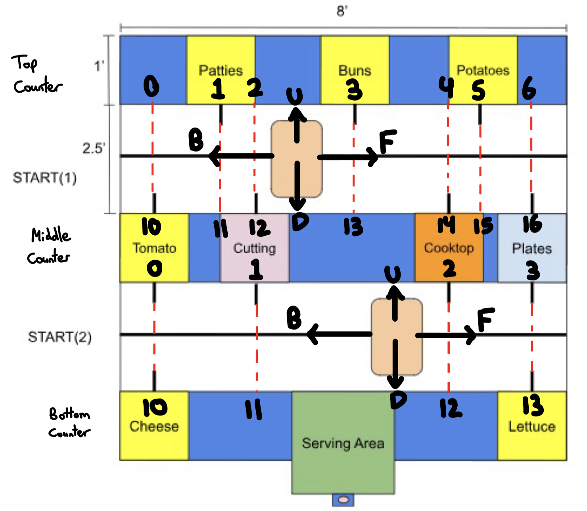
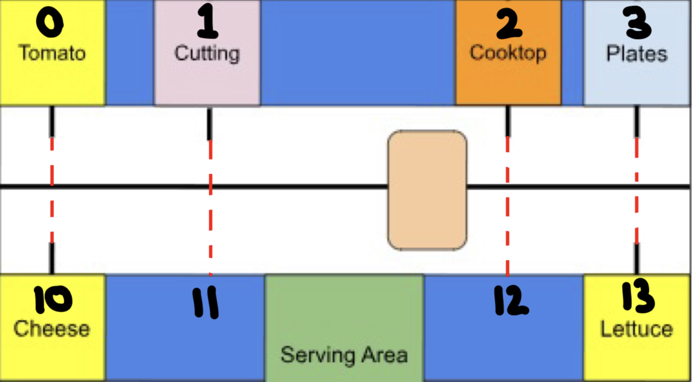
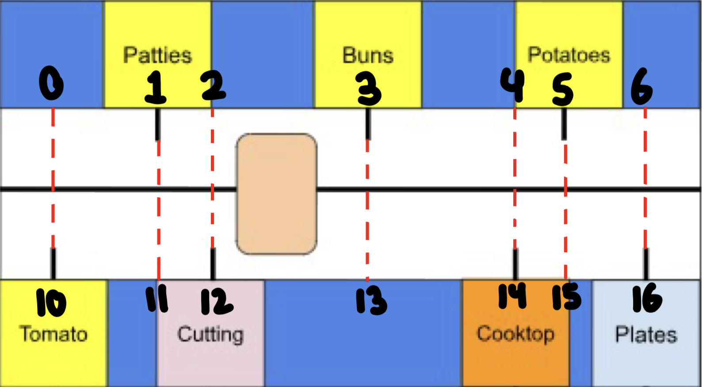

Overview

This README outlines how the code in the drive.cpp file will enable the robots to navigate between any two food stations. The overall premise is as follows: if necessary, the robot will cross over to the other counter by driving up or down (denoted U and D in the diagrams below). It will stop at approximately halfway between the two counters, rotate 180 degrees, and then continue the rest of the distance to the other counter. Next, it will drive forwards or backwards (F or B) until it reaches the desired node (which is the only step if the robot is already at the desired counter - meaning we should try to minimize crossing). Each node is denoted by a different number, and notice that not every node is a food station.

Crossing to the Other Counter

The numbers of any two nodes that line up vertically always differ by 10. For both robots, whenever we cross to the other side, we can simply add or subtract 10 to determine the node we have arrived at. Additionally, based on whether our current node number is above or below 10, and if the desired node is the opposite, we must cross over.

Traversing Along a Counter

Once we are on right side, we will arrive at the desired node by counting the number of tape pieces the robot crosses as it drives along the counter. This part differs very slightly for the two robots, so I will address the bottom bot first, referencing the following diagram.

As you can see, every node on the middle counter has a tape piece. This makes it simple; the difference between the number of the node the bottom bot is at and the one it is travelling to is equal to the number of tape pieces it must cross. On the bottom counter, not every node has a tape piece. This time, we can say that if the node number is greater than our current node, we must move forwards by one tape piece, and if it less than our current node, we must move backwards by one tape piece.

The top bot is more complicated, as the food stations on either side never line up with each other. This introduces many more nodes, however both sides can be dealt with the same way. We take the difference between nodes numbers, divide by two, and round up. This gives us the number of tape pieces away the desired node is. For example, if we are moving from 11 to 16, we calculate: 16 - 11 = 5, 5 / 2 = 2 (this is how division works with integers), 2 + 1 = 3 (the +1 is the “rounding”). Therefore the third tape piece we reach in the forward direction (forward because 16 > 11) marks the desired node.

Counting Tape

There will be a global variable that is incremented by an interrupt function that is triggered every time the reflectance sensor detects black tape. To avoid incrementing the counter multiple times for the same piece of tape, we can start a timer (ESP32’s have built in hardware timers) when we first increment the counter, and the next time the interrupt is called, if the timer has not reached 0.2 seconds, we won’t increment the counter. The robot will definitely have crossed the tape piece in 0.2 seconds, and definitely won’t reach the next one in 0.2 seconds.

Additional Points to Address

There are a couple things that could lead to unreliability and require additional attention. When the robot spins to face the other direction halfway between counters, it may or may not be able to spin 180 degrees accurately. If it can’t, we may have to use the centre tape line to keep the robot centred. This would likely mean having to put a second reflectance sensor circuit parallel to the centre tape line (perpendicular to the other one). If the robot crosses to the other side and doesn’t properly follow the red dotted line, it could lead to issues, but likely only for the bottom bot’s transitions between nodes 0 and 10, and nodes 3 and 13. This is because a slight drift in one direction could end up counting the black tape of the node it was supposed to arrive at when it starts the forward/backward travel. I actually think this would be an issue even if it was perfectly lined up. This could be fixed by beginning a timer after crossing (similarly to as described in the counting tape section above) and not counting any tape pieces that are encountered in the first ~0.5 seconds of forward/backward travel.

I do not expect that these will cause difficult issues, but it is best to keep them in mind.

Start and End Sequences

There are certain paths at the beginning and end of the production of each meal that the robots will always follow. These paths either don’t involve a start node or don’t involve an end node, and therefore can’t be navigated as the rest of the process is. Instead, we will address them individually and instruct the robot on what to do.

At the beginning, the bottom bot will travel from the left side of the centre tape line (the starting position) to the plate station, and the top bot will travel from the same starting position to the bun station. They will do this almost identically to before: move sideways to the counter, then count the number of tape pieces to the station. The hard coded part of this is the number of tape pieces it must count.

Once the bottom bot is ready to serve the meal, it will navigate to node 10, 11, 12, or 13 (whichever is closest), and then move forwards/backwards until the IR signal is detected strongly enough. Next it will cross to the other counter, move two tape pieces forward, and pick up another plate.

One last thing: when the robot spins around (so that the sweeper arm is always on the side of the counter), the directions that the wheels will have to spin to travel in the forwards and backwards directions will swap.

Check out the code itself to see how this was all implemented. If you have ideas for improvements, awesome.
